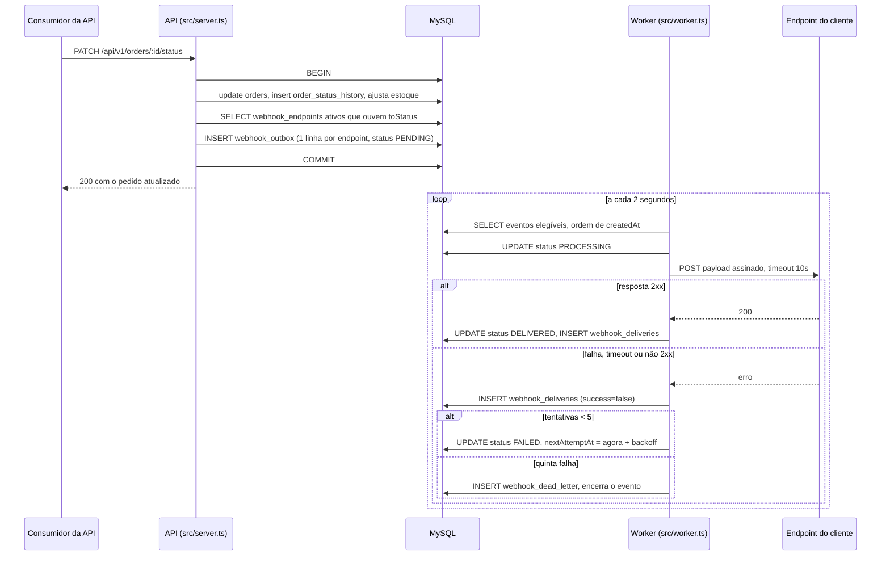

### FDD: Sistema de Webhooks de Notificação de Pedidos

Versão: 1.0
Data: 2026-08-16
Responsável: Larissa, Tech Lead, com revisão técnica de Diego (Plataforma), Bruno (Pedidos) e Sofia (Segurança)

---

### 1. Contexto e motivação técnica

O OMS controla o ciclo de vida do pedido por máquina de estados explícita em [order.status.ts:3-10](../src/modules/orders/order.status.ts#L3-L10) e executa a mudança de status dentro de uma única transação em [order.service.ts:131-178](../src/modules/orders/order.service.ts#L131-L178), onde valida a transição, debita ou repõe estoque, atualiza `orders` e insere em `order_status_history`. Não existe hoje nenhum ponto de extensão para notificação externa: não há evento, fila, mensageria nem webhook em nenhum ponto da codebase.

Os clientes B2B compensam essa ausência com polling em `GET /api/v1/orders`, o que torna a integração deles lenta e cara ([09:00] Marcos). O requisito é notificar em menos de 10 segundos após a mudança de status ([09:02] Marcos), sem acoplar a operação interna à disponibilidade de terceiros ([09:04] Bruno).

Este documento especifica **como construir**. As decisões de arquitetura já estão fechadas e registradas nos ADRs: outbox transacional no MySQL, worker em processo separado com polling, retry com backoff e Dead Letter, HMAC-SHA256 com secret por endpoint, entrega at-least-once e reuso dos padrões existentes. Aqui estão o modelo de dados, os fluxos passo a passo, os contratos, a matriz de erros e os pontos exatos de acoplamento com o código atual.

**Atores**

- **Cliente B2B**, consumidor final das notificações, dono do endpoint de destino e responsável por verificar a assinatura e deduplicar por identificador de evento ([09:20] Sofia, [09:25] Diego).
- **Usuário autenticado do OMS**, que representa o cliente e opera o cadastro dos endpoints pela API, com JWT do próprio sistema ([09:32] Marcos).
- **Administrador**, usuário com role ADMIN, único autorizado a reprocessar eventos em Dead Letter ([09:36] Sofia).
- **Processo de API**, entry-point atual em [src/server.ts](../src/server.ts), responsável por gravar o evento na outbox dentro da transação.
- **Processo de worker**, entry-point novo, responsável por ler a outbox e entregar os eventos ([09:11] Diego).

**Suposições**

- O usuário que opera o cadastro é um usuário do OMS, portanto o identificador do cliente vem no corpo ou no caminho da requisição, nunca do token ([09:32] Bruno, [09:32] Larissa).
- Existe apenas um processo de worker ativo. A ordenação por pedido depende disso ([09:12] Diego).
- O cliente responde com qualquer 2xx dentro do timeout para indicar sucesso. Qualquer outra coisa é falha.

**Restrições**

- Nenhuma infraestrutura nova. Sem broker, sem Redis, sem serviço adicional ([09:07] Larissa, [09:07] Diego).
- Nenhum módulo existente muda de comportamento. A única alteração em código de produção existente é a chamada de publicação dentro da transação de mudança de status ([09:40] Bruno).
- Códigos de erro do módulo obrigatoriamente com prefixo `WEBHOOK_` ([09:29] Larissa).
- Identificadores em UUID, seguindo o padrão do restante do schema ([09:51] Larissa).

---

### 2. Objetivos técnicos

- **Atomicidade entre mudança de status e registro do evento.** Invariante: existe linha na outbox se e somente se a transação de mudança de status commitou. Falha na gravação do evento provoca rollback da transação inteira ([09:40] Bruno, [09:41] Diego).
- **Latência de entrega abaixo de 10 segundos.** Medida entre o commit da transação e a primeira tentativa de entrega, com piso de 2 segundos imposto pelo ciclo de polling ([09:02] Marcos, [09:10] Larissa).
- **Nenhuma perda silenciosa de evento.** Invariante: todo evento gravado termina como entregue ou persistido na Dead Letter com motivo da falha. Nunca desaparece ([09:15] Diego, [09:18] Diego).
- **Entrega at-least-once com identificador estável.** Invariante: o mesmo evento carrega o mesmo `X-Event-Id` em todas as tentativas, inclusive após replay ([09:25] Diego).
- **Janela de recuperação de aproximadamente 15 horas.** Cinco tentativas com backoff de 1m, 5m, 30m, 2h e 12h antes da Dead Letter ([09:17] Diego).
- **Autenticidade e integridade verificáveis pelo cliente.** Invariante: 100% das entregas assinadas com HMAC-SHA256 usando a secret exclusiva do endpoint ([09:20] Sofia, [09:21] Sofia).
- **Zero alteração na infraestrutura transversal.** Middleware de erro, logger, autenticação, validação e paginação são reusados como estão ([09:29] Bruno, [09:30] Larissa).

---

### 3. Escopo e exclusões

**Incluído**

- Quatro tabelas novas no MySQL existente, por migration Prisma: configuração de endpoints, outbox, histórico de entregas e Dead Letter.
- Módulo novo em `src/modules/webhooks`, com controller, service, repository, routes e schemas, no mesmo formato dos módulos atuais ([09:27] Bruno).
- Função `publishWebhookEvent(tx, order, fromStatus, toStatus)` chamada de dentro da transação de mudança de status ([09:41] Bruno).
- Entry-point novo `src/worker.ts` com script `npm run worker`, e lógica de processamento em arquivo dentro do módulo ([09:11] Larissa, [09:28] Bruno).
- CRUD de configuração, filtro de eventos por status, rotação de secret com grace period, histórico de entregas e replay administrativo de Dead Letter.
- Assinatura HMAC-SHA256, headers de entrega e payload snapshot.

**Excluído**

| Item | Situação | Origem |
| --- | --- | --- |
| Aviso por email ao cliente quando o webhook falha | Descartado nesta fase, reavaliar após medir impacto | [09:37] Marcos, [09:37] Larissa |
| Dashboard ou painel visual para o cliente | Descartado, projeto separado do time de frontend | [09:39] Marcos, [09:40] Larissa |
| Controle de vazão na saída por cliente | Adiado, observar em produção antes de implementar | [09:38] Diego, [09:39] Larissa |
| Webhooks de entrada, do cliente para a plataforma | Fora de escopo desde a definição, o fluxo é só de saída | [09:02] Sofia, [09:02] Marcos |
| Arquivamento das linhas entregues da outbox | Reconhecido como necessário, fora do escopo desta feature | [09:08] Diego |
| Múltiplos workers em paralelo e ordenação global | Adiado, caminhos conhecidos são particionar por pedido ou lock pessimista | [09:12] Diego, [09:13] Diego |
| Garantia exactly-once | Descartada, exigiria coordenação dos dois lados | [09:25] Diego |
| Restrição de role no CRUD de configuração | Adiado, qualquer role autenticada opera o CRUD nesta fase | [09:36] Marcos, [09:37] Sofia |

**Parâmetros configuráveis e valores default**

Novas variáveis validadas em [src/config/env.ts](../src/config/env.ts), que já usa schema Zod com defaults e falha o boot quando a configuração é inválida.

| Parâmetro | Default | Origem |
| --- | --- | --- |
| Intervalo de polling do worker | 2000 ms | [09:09] Diego |
| Tamanho do lote por ciclo | Lote pequeno. A reunião definiu o critério mas não fixou número, então o valor exato é calibrado na implementação | [09:08] Diego |
| Timeout da chamada HTTP de entrega | 10000 ms | [09:42] Diego |
| Máximo de tentativas | 5 | [09:15] Diego, [09:16] Diego |
| Progressão do backoff | 1m, 5m, 30m, 2h, 12h | [09:17] Diego |
| Limite de payload por evento | 65536 bytes, 64KB | [09:23] Sofia, [09:24] Diego |
| Grace period da secret anterior | 24 h | [09:21] Sofia |

---

### 4. Fluxos detalhados e diagramas

#### 4.1 Modelo de dados

Quatro models novos em [prisma/schema.prisma](../prisma/schema.prisma), seguindo as convenções já usadas em todo o schema: `id String @id @default(uuid()) @db.Char(36)`, `createdAt` e `updatedAt`, `@@index` nos campos de filtro e `@@map` com nome de tabela em snake_case. Nenhum model existente é alterado, a migration é puramente aditiva.

**`webhook_endpoints`**, configuração do endpoint. Campos derivados de [09:21] Bruno, que descreve url, secret, cliente e estado ativo, de [09:21] Sofia, que exige rotação com convivência, e de [09:33] Marcos, que exige filtro por status.

| Campo | Tipo | Semântica |
| --- | --- | --- |
| `id` | Char(36) UUID | Chave primária, enviada ao cliente no header `X-Webhook-Id` |
| `customerId` | Char(36) | Relação com `customers`, cliente dono do endpoint |
| `url` | VarChar(2048) | Destino da entrega, obrigatoriamente https |
| `secret` | VarChar(255) | Secret ativa, usada na assinatura |
| `previousSecret` | VarChar(255) nullable | Secret anterior, válida durante o grace period |
| `previousSecretExpiresAt` | DateTime nullable | Momento em que a secret anterior deixa de valer |
| `events` | Json | Lista de valores do enum `OrderStatus` que o endpoint quer ouvir |
| `active` | Boolean default true | Endpoint inativo não gera evento novo |
| `createdAt` / `updatedAt` | DateTime | Padrão do projeto |

Índices: `customerId` e `active`, que são exatamente os filtros da consulta feita dentro da transação.

**`webhook_outbox`**, eventos pendentes de entrega. Derivada de [09:06] Diego para o desenho, [09:08] Diego para os estados e índices, e [09:52] Larissa para o snapshot.

| Campo | Tipo | Semântica |
| --- | --- | --- |
| `id` | Char(36) UUID | Chave primária e também o identificador do evento enviado em `X-Event-Id` |
| `webhookEndpointId` | Char(36) | Endpoint de destino |
| `orderId` | Char(36) | Pedido de origem, usado para diagnóstico e ordenação |
| `eventType` | VarChar(64) | `order.status_changed` |
| `payload` | Json | Snapshot renderizado no momento da gravação |
| `status` | Enum `PENDING`, `PROCESSING`, `FAILED`, `DELIVERED` | Estados citados textualmente em [09:08] Diego |
| `attemptCount` | Int default 0 | Tentativas já realizadas, teto de 5 |
| `nextAttemptAt` | DateTime nullable | Agendamento da próxima tentativa |
| `lastError` | VarChar(500) nullable | Motivo da última falha |
| `createdAt` / `updatedAt` | DateTime | `createdAt` define a ordem de processamento |

Índices: composto `(status, nextAttemptAt)` para a consulta do worker, e `createdAt` para a ordenação, ambos citados em [09:08] Diego.

**`webhook_deliveries`**, histórico de tentativas. Derivada de [09:34] Marcos, que pede sucesso ou falha, payload, resposta e tempo de resposta.

| Campo | Tipo | Semântica |
| --- | --- | --- |
| `id` | Char(36) UUID | Chave primária |
| `outboxEventId` | Char(36) | Identificador do evento, estável entre tentativas |
| `webhookEndpointId` | Char(36) | Endpoint de destino |
| `attemptNumber` | Int | Número da tentativa, de 1 a 5 |
| `success` | Boolean | Verdadeiro quando a resposta foi 2xx dentro do timeout |
| `responseStatus` | Int nullable | Status HTTP devolvido, nulo em timeout ou erro de rede |
| `responseBody` | Text nullable | Corpo da resposta, truncado para armazenamento |
| `durationMs` | Int | Tempo de resposta medido |
| `errorCode` | VarChar(64) nullable | Código interno da falha |
| `createdAt` | DateTime | Momento da tentativa |

Índices: `outboxEventId` e composto `(webhookEndpointId, createdAt)`, que é a consulta do histórico.

**`webhook_dead_letter`**, falhas permanentes. Derivada de [09:18] Diego, que pede payload, motivo da falha e timestamp em tabela separada.

| Campo | Tipo | Semântica |
| --- | --- | --- |
| `id` | Char(36) UUID | Chave primária, usada no replay |
| `outboxEventId` | Char(36) | Identificador original do evento, preservado no replay |
| `webhookEndpointId` | Char(36) | Endpoint de destino |
| `orderId` | Char(36) | Pedido de origem |
| `payload` | Json | Snapshot original, intocado |
| `failureReason` | VarChar(500) | Motivo da falha permanente |
| `failedAt` | DateTime | Momento em que esgotou as tentativas |

Índices: `webhookEndpointId` e `failedAt`.

#### 4.2 Fluxo principal

Gravação do evento dentro da transação de mudança de status.

- O consumidor chama `PATCH /api/v1/orders/:id/status`, rota existente registrada em [order.routes.ts:19-23](../src/modules/orders/order.routes.ts#L19-L23), autenticada pelo middleware atual.
- O controller invoca `OrderService.changeStatus`, que abre a transação em [order.service.ts:131](../src/modules/orders/order.service.ts#L131).
- Dentro da transação, o comportamento atual não muda: carrega o pedido, valida a transição com `canTransition`, debita ou repõe estoque, atualiza o status e insere no histórico.
- Depois de recarregar o pedido com relações, em [order.service.ts:169-176](../src/modules/orders/order.service.ts#L169-L176), a nova chamada `publishWebhookEvent(tx, refreshed, from, to)` é executada como última operação antes do retorno.
- A função consulta os endpoints do cliente do pedido que estejam ativos e cuja lista de eventos contenha o status de destino.
- Se nenhum endpoint estiver interessado, nada é gravado. O filtro acontece na gravação, não no envio, para economizar linha na tabela ([09:34] Marcos, [09:34] Bruno, [09:34] Diego).
- Para cada endpoint interessado, gera um UUID de evento, renderiza o payload snapshot descrito em 5.8, valida o teto de 64KB e insere uma linha com status pendente.
- A transação commita e a resposta HTTP da mudança de status retorna imediatamente, sem esperar entrega nenhuma.

**Sequência ponta a ponta**



**Processamento pelo worker**

- O processo sobe pelo entry-point novo, replicando o padrão de [src/server.ts](../src/server.ts): logger, tratamento de `SIGINT` e `SIGTERM` e `prisma.$disconnect()` no encerramento.
- O worker cria a própria instância do cliente Prisma usando `createPrismaClient()` de [database.ts:4-8](../src/config/database.ts#L4-L8), apontando para a mesma `DATABASE_URL`, porque o cliente é por processo ([09:30] Bruno).
- A cada ciclo, consulta os eventos elegíveis, que são os pendentes e os falhos cujo horário agendado já chegou, ordenados por data de criação, limitados ao tamanho do lote.
- Marca o evento como em processamento, monta os headers de 5.8, calcula a assinatura sobre o corpo exato que será enviado e executa o POST com timeout de 10 segundos.
- Registra a tentativa no histórico de entregas em qualquer desfecho, com número da tentativa, sucesso, status HTTP, tempo de resposta e código do erro quando houver.
- Resposta 2xx marca o evento como entregue. Qualquer outro desfecho segue para o fluxo de reenvio.
- O processamento é sequencial, um evento por vez. Isso é o que preserva a ordenação por pedido enquanto houver um único worker ([09:12] Diego).

**Reenvio com backoff**

| Tentativa que falhou | Espera até a próxima | Acumulado desde a primeira falha |
| --- | --- | --- |
| 1 | 1 minuto | 1 min |
| 2 | 5 minutos | 6 min |
| 3 | 30 minutos | 36 min |
| 4 | 2 horas | 2h36 |
| 5 | não há próxima, vai para Dead Letter | cerca de 14h36, próximo das 15 horas citadas em [09:17] Diego |

Em cada falha, o worker incrementa a contagem de tentativas, preenche o motivo do erro e grava a tentativa no histórico. Se ainda houver tentativa disponível, agenda a próxima e devolve o evento ao estado de falha aguardando reenvio. Na quinta falha, segue para a Dead Letter.

**Dead Letter e replay**

- O worker grava o evento na tabela de Dead Letter com payload, motivo e timestamp, e encerra o evento no fluxo ativo. A tabela separada mantém limpa a leitura da outbox e serve de evidência para diagnóstico ([09:18] Diego).
- O replay é manual, por endpoint administrativo restrito a ADMIN ([09:35] Diego, [09:36] Sofia).
- O replay recoloca o evento na outbox como pendente, com a contagem de tentativas zerada e **preservando o identificador original do evento**, de forma que para o cliente seja uma reentrega do mesmo evento e a deduplicação por `X-Event-Id` continue funcionando.
- A operação registra em log o identificador do usuário que executou, exigência explícita de auditoria ([09:36] Sofia).

**Rotação de secret**

- O cliente solicita a rotação. O sistema gera a nova secret, move a atual para o campo de secret anterior e define a expiração dela para 24 horas à frente.
- Durante o grace period, o worker assina cada entrega com as duas secrets e envia as duas assinaturas no header, separadas por vírgula, com a nova primeiro. O cliente valida contra qualquer uma das duas e migra no ritmo dele.
- Expirado o grace period, o campo da secret anterior é limpo e a assinatura volta a ser única.

#### 4.3 Fluxos alternativos e exceções

- **Nenhum endpoint interessado no status.** Nenhuma linha é gravada e a mudança de status segue normalmente, com custo zero ([09:34] Bruno).
- **Endpoint inativo.** Não entra na consulta e não recebe evento novo. Eventos já gravados antes da desativação continuam no fluxo.
- **Falha na gravação do evento.** A exceção propaga e a transação inteira sofre rollback, cancelando também a mudança de status. É o comportamento desejado ([09:40] Bruno, [09:41] Diego).
- **Payload acima de 64KB.** Erro na gravação, sem truncar, o que provoca rollback da transação ([09:23] Sofia, [09:24] Diego).
- **Timeout do cliente.** Tratado como falha, sem status HTTP registrado, e segue para reenvio ([09:42] Diego).
- **Resposta 4xx do cliente.** Tratada como falha e segue para reenvio, porque pode ser endpoint migrado ou indisponibilidade temporária do lado do cliente. Não há distinção entre 4xx e 5xx nesta fase.
- **Queda do worker no meio de um envio.** O evento fica preso em processamento. No início de cada ciclo, eventos em processamento cuja última atualização passou de 30 segundos voltam a pendente. Esse é o cenário que torna a duplicata possível e que justifica a semântica at-least-once ([09:24] Diego).
- **Pedido alterado depois da gravação do evento.** O payload entregue não muda, porque é snapshot ([09:52] Larissa).
- **Endpoint removido com eventos ainda na outbox.** A reunião não decidiu esse ponto. Fica registrado como questão em aberto no [RFC](RFC.md), e a implementação não deve assumir comportamento sem essa definição.

---

### 5. Contratos públicos

Todas as rotas ficam sob o prefixo `/api/v1`, já montado em [app.ts:67](../src/app.ts#L67), com o router do módulo registrado em [routes/index.ts](../src/routes/index.ts) no mesmo padrão dos demais. Todas exigem autenticação pelo middleware existente, e apenas o replay exige ADMIN ([09:36] Larissa, [09:37] Sofia).

Validação de entrada pelo middleware existente [validate.middleware.ts](../src/middlewares/validate.middleware.ts), com schemas Zod novos do módulo. Paginação pelo helper `paginated()` de [response.ts:22-24](../src/shared/http/response.ts#L22-L24), que produz o envelope `data` mais `pagination`.

Erros seguem o envelope padrão produzido por [error.middleware.ts:14-24](../src/middlewares/error.middleware.ts#L14-L24):

```json
{
  "error": {
    "code": "WEBHOOK_NOT_FOUND",
    "message": "Webhook endpoint not found",
    "details": {}
  }
}
```

#### 5.1 Função de publicação do evento

- Tipo: function
- Assinatura:

```ts
// src/modules/webhooks/webhook.publisher.ts (arquivo novo)
export async function publishWebhookEvent(
  tx: Prisma.TransactionClient,
  order: OrderWithRelations,
  fromStatus: OrderStatus,
  toStatus: OrderStatus,
): Promise<void>;
```

- Semântica: recebe o cliente transacional em uso e executa dentro da transação do chamador. Não abre transação própria, não injeta repository e não faz nenhuma chamada de rede. Lança exceção em falha, o que provoca rollback no chamador ([09:41] Bruno, [09:41] Diego).

#### 5.2 `POST /api/v1/webhooks`, cadastrar endpoint

- Tipo: http_endpoint
- Método: POST
- Autorização: qualquer role autenticada ([09:37] Sofia)

Requisição:

```json
{
  "customerId": "9b2f1c34-6d1a-4f0e-9b1d-2a7c3e5f8a01",
  "url": "https://integracao.atlascomercial.com.br/oms/webhooks",
  "events": ["SHIPPED", "DELIVERED"]
}
```

Resposta `201 Created`. A secret é gerada pelo sistema e devolvida apenas aqui e na rotação ([09:31] Marcos):

```json
{
  "id": "1a2b3c4d-0000-4000-8000-1234567890ab",
  "customerId": "9b2f1c34-6d1a-4f0e-9b1d-2a7c3e5f8a01",
  "url": "https://integracao.atlascomercial.com.br/oms/webhooks",
  "events": ["SHIPPED", "DELIVERED"],
  "active": true,
  "secret": "whsec_4f8a01c3e5f2a7c39b1d6d1a4f0e9b2f",
  "createdAt": "2026-11-03T12:00:00.000Z"
}
```

Semântica de status: `201` criado, `400` `VALIDATION_ERROR` para corpo fora do schema, `401` `UNAUTHORIZED` sem token válido, `404` `WEBHOOK_CUSTOMER_NOT_FOUND` para cliente inexistente, `422` `WEBHOOK_INVALID_URL` para URL fora de https e `422` `WEBHOOK_EVENTS_REQUIRED` para lista de status vazia.

#### 5.3 `GET /api/v1/webhooks`, listar endpoints de um cliente

- Tipo: http_endpoint
- Método: GET
- Query: `customerId` obrigatório, `page` default 1, `pageSize` default 20 e teto 100, mesmos limites do schema de listagem já usado em [order.schemas.ts:23-30](../src/modules/orders/order.schemas.ts#L23-L30)

Resposta `200 OK`. A secret nunca aparece em listagem:

```json
{
  "data": [
    {
      "id": "1a2b3c4d-0000-4000-8000-1234567890ab",
      "customerId": "9b2f1c34-6d1a-4f0e-9b1d-2a7c3e5f8a01",
      "url": "https://integracao.atlascomercial.com.br/oms/webhooks",
      "events": ["SHIPPED", "DELIVERED"],
      "active": true,
      "createdAt": "2026-11-03T12:00:00.000Z"
    }
  ],
  "pagination": { "page": 1, "pageSize": 20, "total": 1, "totalPages": 1 }
}
```

Semântica de status: `200` sucesso, `400` `VALIDATION_ERROR` para query inválida, `401` sem token.

#### 5.4 `PATCH /api/v1/webhooks/:id`, editar endpoint

- Tipo: http_endpoint
- Método: PATCH

Requisição, todos os campos opcionais:

```json
{
  "url": "https://integracao.atlascomercial.com.br/oms/webhooks/v2",
  "events": ["PAID", "SHIPPED", "DELIVERED"],
  "active": true
}
```

Resposta `200 OK`:

```json
{
  "id": "1a2b3c4d-0000-4000-8000-1234567890ab",
  "customerId": "9b2f1c34-6d1a-4f0e-9b1d-2a7c3e5f8a01",
  "url": "https://integracao.atlascomercial.com.br/oms/webhooks/v2",
  "events": ["PAID", "SHIPPED", "DELIVERED"],
  "active": true,
  "updatedAt": "2026-11-03T14:30:00.000Z"
}
```

Semântica de status: `200` atualizado, `400` `VALIDATION_ERROR`, `401` sem token, `404` `WEBHOOK_NOT_FOUND`, `422` `WEBHOOK_INVALID_URL`.

#### 5.5 `DELETE /api/v1/webhooks/:id`, remover endpoint

- Tipo: http_endpoint
- Método: DELETE

Resposta `204 No Content`, sem corpo, seguindo o padrão de [order.controller.ts:48-55](../src/modules/orders/order.controller.ts#L48-L55).

Semântica de status: `204` removido, `401` sem token, `404` `WEBHOOK_NOT_FOUND`.

#### 5.6 `POST /api/v1/webhooks/:id/rotate-secret`, rotacionar secret

- Tipo: http_endpoint
- Método: POST
- Requisição: sem corpo

Resposta `200 OK`:

```json
{
  "id": "1a2b3c4d-0000-4000-8000-1234567890ab",
  "secret": "whsec_9b1d6d1a4f0e9b2f4f8a01c3e5f2a7c3",
  "previousSecretExpiresAt": "2026-11-04T12:00:00.000Z"
}
```

Semântica: a partir daqui e por 24 horas, cada entrega carrega duas assinaturas no header, e o cliente pode validar com qualquer uma ([09:21] Sofia).

Semântica de status: `200` rotacionada, `401` sem token, `404` `WEBHOOK_NOT_FOUND`.

#### 5.7 `GET /api/v1/webhooks/:id/deliveries`, histórico de entregas

- Tipo: http_endpoint
- Método: GET
- Query: `page` default 1, `pageSize` default 100 e teto 100, coerente com a referência de últimas 100 entregas dada em [09:34] Marcos

Resposta `200 OK`:

```json
{
  "data": [
    {
      "id": "7c8d9e0f-0000-4000-8000-abcdef123456",
      "eventId": "5f0c9a7e-0000-4000-8000-fedcba654321",
      "attemptNumber": 1,
      "success": true,
      "responseStatus": 200,
      "responseBody": "{\"ok\":true}",
      "durationMs": 184,
      "createdAt": "2026-11-20T14:32:13.000Z"
    },
    {
      "id": "8d9e0f1a-0000-4000-8000-abcdef654321",
      "eventId": "6a1d0b8f-0000-4000-8000-fedcba987654",
      "attemptNumber": 3,
      "success": false,
      "responseStatus": null,
      "responseBody": null,
      "durationMs": 10000,
      "errorCode": "WEBHOOK_DELIVERY_TIMEOUT",
      "createdAt": "2026-11-20T15:08:41.000Z"
    }
  ],
  "pagination": { "page": 1, "pageSize": 100, "total": 2, "totalPages": 1 }
}
```

Semântica de status: `200` sucesso, `401` sem token, `404` `WEBHOOK_NOT_FOUND`.

#### 5.8 `POST /api/v1/admin/webhooks/dead-letter/:id/replay`, replay de Dead Letter

- Tipo: http_endpoint
- Método: POST
- Autorização: `requireRole('ADMIN')` de [auth.middleware.ts:49-61](../src/middlewares/auth.middleware.ts#L49-L61) ([09:36] Larissa)
- Requisição: sem corpo

Resposta `202 Accepted`:

```json
{
  "deadLetterId": "3e4f5a6b-0000-4000-8000-111122223333",
  "eventId": "5f0c9a7e-0000-4000-8000-fedcba654321",
  "status": "PENDING",
  "attemptCount": 0,
  "replayedBy": "8a7b6c5d-0000-4000-8000-999988887777",
  "replayedAt": "2026-11-21T09:12:00.000Z"
}
```

Semântica: `202` porque a operação apenas reenfileira, a entrega acontece no ciclo seguinte do worker. O identificador do evento é o original, preservado justamente para não quebrar a deduplicação do cliente.

Semântica de status: `202` reenfileirado, `401` sem token, `403` `FORBIDDEN` para role diferente de ADMIN, `404` `WEBHOOK_DEAD_LETTER_NOT_FOUND`.

#### 5.9 Entrega ao endpoint do cliente

- Tipo: http_endpoint de saída
- Método: POST na URL cadastrada no endpoint

Headers ([09:44] Diego, [09:44] Sofia):

| Header | Semântica |
| --- | --- |
| `Content-Type` | `application/json` |
| `X-Event-Id` | UUID do evento, estável em todas as tentativas e no replay, é a chave de deduplicação do cliente |
| `X-Signature` | HMAC-SHA256 do corpo exato enviado, em hexadecimal. Durante o grace period da rotação, duas assinaturas separadas por vírgula, a nova primeiro |
| `X-Timestamp` | Timestamp ISO 8601 do envio, permite ao cliente detectar replay attack se quiser |
| `X-Webhook-Id` | Identificador do cadastro de webhook, distingue múltiplos endpoints do mesmo cliente |

Corpo, snapshot enxuto sem os itens do pedido ([09:43] Diego):

```json
{
  "event_id": "5f0c9a7e-0000-4000-8000-fedcba654321",
  "event_type": "order.status_changed",
  "timestamp": "2026-11-20T14:32:11.000Z",
  "order_id": "0d1e2f3a-0000-4000-8000-444455556666",
  "order_number": "ORD-000123",
  "from_status": "PROCESSING",
  "to_status": "SHIPPED",
  "customer_id": "9b2f1c34-6d1a-4f0e-9b1d-2a7c3e5f8a01",
  "total_cents": 15990
}
```

Limites e tempos: payload máximo de 64KB, timeout de 10 segundos por chamada, sem controle de vazão nesta fase.

Semântica de resposta esperada do cliente: qualquer 2xx dentro do timeout significa entregue. Qualquer outro status, timeout ou erro de rede significa falha e entra no fluxo de reenvio. O cliente que precisar dos itens do pedido consulta `GET /api/v1/orders/:id` depois ([09:43] Diego).

**Versionamento:** os endpoints entram sob `/api/v1`, e a mudança é puramente aditiva, sem alterar nenhuma rota existente. O formato do payload de entrega passa a ser contrato público com os clientes B2B, e alterações futuras nele exigem campo novo opcional ou nova versão de evento, nunca remoção ou renomeação de campo existente.

---

### 6. Erros, exceções e fallback

#### Matriz de erros

Todas as classes novas estendem `AppError` de [app-error.ts:3-16](../src/shared/errors/app-error.ts#L3-L16), no mesmo molde de `InsufficientStockError` e `InvalidStatusTransitionError` em [http-errors.ts:45-63](../src/shared/errors/http-errors.ts#L45-L63). O middleware de erro trata qualquer instância de `AppError` sem precisar de alteração ([09:29] Bruno).

| Código | HTTP | Condição | Tratamento |
| --- | --- | --- | --- |
| `WEBHOOK_NOT_FOUND` | 404 | Endpoint inexistente em edição, remoção, rotação ou consulta de entregas | Retorna sem efeito colateral. Código citado textualmente em [09:28] Bruno |
| `WEBHOOK_INVALID_URL` | 422 | URL malformada ou fora de https no cadastro ou na edição | Recusado na validação de schema, endpoint não é criado nem alterado ([09:23] Sofia). Código citado em [09:28] Bruno |
| `WEBHOOK_SECRET_REQUIRED` | 422 | Operação que exige secret ativa em endpoint sem secret válida | Recusa a operação até nova secret ser gerada. Código citado em [09:28] Bruno |
| `WEBHOOK_EVENTS_REQUIRED` | 422 | Lista de status vazia ou com valor fora do enum `OrderStatus` | Recusado na validação. Derivado de [09:33] Marcos |
| `WEBHOOK_CUSTOMER_NOT_FOUND` | 404 | Cliente informado no cadastro não existe | Recusa antes de gravar. Derivado de [09:32] Larissa |
| `WEBHOOK_INACTIVE` | 422 | Rotação ou operação equivalente sobre endpoint inativo | Recusa a operação. Derivado de [09:21] Bruno |
| `WEBHOOK_PAYLOAD_TOO_LARGE` | 422 | Payload serializado do evento acima de 64KB | Erro na gravação, sem truncar, provoca rollback da transação de mudança de status ([09:23] Sofia, [09:24] Diego) |
| `WEBHOOK_DEAD_LETTER_NOT_FOUND` | 404 | Replay de item inexistente na Dead Letter | Retorna sem efeito colateral. Derivado de [09:35] Diego |
| `WEBHOOK_DELIVERY_TIMEOUT` | interno | Cliente não respondeu dentro de 10 segundos | Registrado no histórico de entregas e contabilizado como falha para reenvio ([09:42] Diego) |
| `WEBHOOK_DELIVERY_FAILED` | interno | Resposta fora da faixa 2xx ou erro de rede | Registrado no histórico e contabilizado como falha para reenvio |
| `WEBHOOK_DELIVERY_EXHAUSTED` | interno | Quinta falha consecutiva do mesmo evento | Evento gravado na Dead Letter com motivo e encerrado no fluxo ativo ([09:18] Diego) |

Erros transversais continuam vindo das classes existentes, sem duplicação no módulo: `VALIDATION_ERROR` em 400 para falha de schema Zod, `UNAUTHORIZED` em 401 e `FORBIDDEN` em 403, todos já implementados em [http-errors.ts:9-25](../src/shared/errors/http-errors.ts#L9-L25) e tratados no middleware central.

#### Estratégias de resiliência

| Mecanismo | Especificação | Origem |
| --- | --- | --- |
| Timeout | 10 segundos por chamada de entrega, estouro tratado como falha | [09:42] Diego |
| Retries | 5 tentativas no total | [09:15] Diego, [09:16] Diego |
| Backoff | Progressão fixa de 1m, 5m, 30m, 2h e 12h, cerca de 15 horas de janela | [09:17] Diego |
| Circuit breaker | Não implementado nesta fase. A reunião não discutiu, e o controle de vazão na saída, que seria o mecanismo vizinho, foi explicitamente adiado | [09:38] Diego, [09:39] Larissa |
| Isolamento de processo | Worker separado da API, queda ou reinício de um não afeta o outro | [09:11] Diego |
| Recuperação de estado | Todo o estado do evento vive no banco, então após uma queda o worker retoma do ponto onde parou e nada se perde, apenas atrasa | Decorrência do desenho de outbox, [09:06] Diego |
| Destravamento de eventos presos | Evento em processamento há mais de 30 segundos volta a pendente no início do ciclo | Necessário para o cenário de queda no meio do envio, consequência do at-least-once de [09:24] Diego |
| Atomicidade | Gravação do evento na mesma transação da mudança de status | [09:40] Bruno |
| Limite de payload | 64KB, com erro e sem truncamento | [09:24] Larissa |

#### Política de fallback

Não existe canal alternativo de notificação. O aviso por email foi descartado nesta fase ([09:37] Larissa), e o dashboard visual está fora de escopo ([09:40] Larissa). A única forma de recuperar um evento que esgotou as tentativas é o replay manual pelo endpoint administrativo. A consequência é que a descoberta de um evento em Dead Letter depende de consulta ativa, o que está registrado como risco em 11.

#### Invariantes

- Existe linha na outbox se e somente se a transação de mudança de status commitou.
- O identificador do evento é imutável e idêntico em todas as tentativas, inclusive após replay.
- A contagem de tentativas nunca regride, exceto por replay explícito de um ADMIN.
- O histórico de entregas é somente de acréscimo, uma linha por tentativa, nunca sobrescrito.
- O payload gravado é imutável desde a gravação até a entrega.
- Nenhum evento sai do sistema sem desfecho registrado, entregue ou em Dead Letter.
- A secret nunca aparece em resposta de listagem nem em log.

---

### 7. Observabilidade

#### Métricas

Sem stack de métricas nova, coerente com a decisão de não subir infraestrutura ([09:07] Diego). As métricas abaixo são extraídas das tabelas do módulo e dos logs estruturados.

- Eventos pendentes na outbox, contagem por estado. É o indicador direto de worker parado ou lento.
- Idade do evento pendente mais antigo, que é o sinal mais confiável de atraso acumulado.
- Total de tentativas de entrega, segmentado por sucesso e falha e por endpoint.
- Latência de entrega, a partir do tempo de resposta registrado por tentativa e da diferença entre a gravação do evento e a primeira tentativa, que é a medida contra a meta de 10 segundos.
- Contagem de eventos em Dead Letter, que deveria permanecer em zero em operação normal.
- Distribuição das tentativas, para identificar endpoints que só entregam após reenvio.

#### Logs

Logger Pino existente em [logger/index.ts:13-32](../src/shared/logger/index.ts#L13-L32), sem biblioteca nova ([09:29] Bruno). O worker usa o mesmo `createLogger()`, com identificação de serviço própria para separar as duas origens.

A lista de redação em [logger/index.ts:4-11](../src/shared/logger/index.ts#L4-L11), que hoje cobre senha, token e header de autorização, precisa passar a cobrir também os campos de secret do módulo.

| Evento de log | Nível | Campos |
| --- | --- | --- |
| Worker iniciado | info | intervalo de polling, tamanho do lote, timeout |
| Evento gravado na outbox | info | requestId, eventId, orderId, customerId, webhookEndpointId, toStatus |
| Tentativa de entrega | info | eventId, webhookEndpointId, orderId, attemptNumber |
| Entrega com sucesso | info | eventId, webhookEndpointId, responseStatus, durationMs, attemptNumber |
| Falha de entrega | warn | eventId, webhookEndpointId, attemptNumber, errorCode, responseStatus, nextAttemptAt |
| Evento movido para Dead Letter | error | eventId, webhookEndpointId, orderId, totalAttempts, failureReason |
| Replay executado | info | deadLetterId, eventId, userId de quem executou ([09:36] Sofia) |
| Evento preso destravado | warn | eventId, tempo em processamento |

#### Tracing

O projeto não tem instrumentação de tracing distribuído hoje, e esta feature não introduz uma. A correlação é feita por identificadores, no mesmo espírito do `X-Request-Id` que [request-logger.middleware.ts:5-28](../src/middlewares/request-logger.middleware.ts#L5-L28) já gera e devolve em toda requisição.

- **Span lógico da API:** a requisição de mudança de status já carrega `requestId`. O log de gravação do evento registra `requestId` junto com `eventId`, o que liga a chamada HTTP original ao evento gerado.
- **Span lógico do worker:** todo log do ciclo de vida da entrega carrega `eventId`, permitindo reconstruir a linha do tempo completa de um evento, da gravação até o desfecho, cruzando outbox, histórico de entregas e Dead Letter.
- **Amostragem:** sem amostragem. O volume de eventos é baixo o suficiente para logar todas as tentativas, e perder registro de tentativa comprometeria a auditoria de entrega.
- **Evolução:** se o projeto adotar tracing distribuído depois, os atributos naturais de span são o identificador do evento, o do endpoint, o do pedido, o número da tentativa e o status HTTP de resposta.

#### Dashboards e alertas

Painel mínimo com quatro leituras: eventos pendentes, idade do evento pendente mais antigo, taxa de falha por endpoint e contagem em Dead Letter.

Alertas mínimos, com limiares a calibrar após a primeira semana de produção, já que a reunião não definiu valores:

- Evento pendente mais antigo acima do limiar, que indica worker parado ou atrasado.
- Qualquer evento novo em Dead Letter, que indica cliente com falha persistente.
- Taxa de falha por endpoint acima do limiar em janela curta.

---

### 8. Integração com o sistema existente

Seção obrigatória deste desafio. Todos os arquivos listados existem hoje no repositório. Arquivos novos a criar estão indicados como tal e concentram-se em `src/modules/webhooks` e em `src/worker.ts`.

| Arquivo existente | Como o módulo se integra |
| --- | --- |
| [src/modules/orders/order.service.ts](../src/modules/orders/order.service.ts) | **Única alteração em código de produção existente.** Em `changeStatus`, dentro do `this.prisma.$transaction` aberto em [linha 131](../src/modules/orders/order.service.ts#L131), depois do recarregamento do pedido com relações em [linhas 169-176](../src/modules/orders/order.service.ts#L169-L176), entra `await publishWebhookEvent(tx, refreshed, from, to)` antes do retorno. Nenhuma outra lógica do método muda: a validação de transição, o débito e a reposição de estoque e a gravação do histórico permanecem idênticos ([09:40] Bruno, [09:41] Diego) |
| [src/modules/orders/order.status.ts](../src/modules/orders/order.status.ts) | Fonte de verdade das transições. Os valores aceitos na lista de eventos de um endpoint são os do enum `OrderStatus`, e `canTransition` em [linhas 12-14](../src/modules/orders/order.status.ts#L12-L14) já garante que apenas transições legais chegam ao ponto de publicação. O módulo de webhooks não revalida transição |
| [src/shared/errors/app-error.ts](../src/shared/errors/app-error.ts) e [src/shared/errors/http-errors.ts](../src/shared/errors/http-errors.ts) | As classes novas do módulo estendem `AppError` e as derivadas existentes, reproduzindo o molde de `InsufficientStockError` e `InvalidStatusTransitionError` em [linhas 45-63](../src/shared/errors/http-errors.ts#L45-L63), com códigos no prefixo `WEBHOOK_`. Os arquivos existentes não são alterados ([09:28] Bruno) |
| [src/middlewares/error.middleware.ts](../src/middlewares/error.middleware.ts) | **Zero alteração.** Já trata qualquer `AppError`, `ZodError` e os erros conhecidos do Prisma em [linhas 14-54](../src/middlewares/error.middleware.ts#L14-L54), então captura os erros do módulo automaticamente e produz o envelope padrão ([09:29] Bruno) |
| [src/middlewares/auth.middleware.ts](../src/middlewares/auth.middleware.ts) | `authenticate` protege todas as rotas do módulo, aplicado com `router.use(authenticate)` no mesmo padrão de [order.routes.ts:14](../src/modules/orders/order.routes.ts#L14). `requireRole('ADMIN')` de [linhas 49-61](../src/middlewares/auth.middleware.ts#L49-L61) protege exclusivamente o replay ([09:36] Larissa) |
| [src/middlewares/validate.middleware.ts](../src/middlewares/validate.middleware.ts) | As rotas do módulo usam `validate({ body, params, query })` com os schemas Zod novos, incluindo a validação de https e a validação da lista de status contra o enum, no mesmo padrão de [order.routes.ts:16-24](../src/modules/orders/order.routes.ts#L16-L24) ([09:23] Sofia) |
| [src/shared/logger/index.ts](../src/shared/logger/index.ts) | Worker e módulo usam o `createLogger()` existente. A lista de redação em [linhas 4-11](../src/shared/logger/index.ts#L4-L11) ganha os campos de secret do módulo, para que a secret nunca apareça em log ([09:22] Diego, [09:29] Bruno) |
| [src/shared/http/response.ts](../src/shared/http/response.ts) | A listagem de endpoints e a consulta de entregas usam `paginated()` de [linhas 22-24](../src/shared/http/response.ts#L22-L24), devolvendo o mesmo envelope `data` mais `pagination` dos demais módulos |
| [src/routes/index.ts](../src/routes/index.ts) | `buildApiRouter` ganha o registro do router do módulo e do router administrativo, no mesmo padrão de composição das [linhas 24-28](../src/routes/index.ts#L24-L28). O tipo `Controllers` ganha a entrada do controller de webhooks |
| [src/app.ts](../src/app.ts) | `buildControllers` ganha a cadeia repository, service e controller do módulo, seguindo a injeção manual já usada nas [linhas 26-53](../src/app.ts#L26-L53). O limite de corpo de requisição da API continua o mesmo definido em [linha 59](../src/app.ts#L59), e não se confunde com o limite de 64KB do payload de evento, que é do fluxo de saída |
| [src/server.ts](../src/server.ts) | Serve de molde para a entry-point nova do worker: função de bootstrap, log de início, tratamento de `SIGINT` e `SIGTERM` e `prisma.$disconnect()` no encerramento, conforme [linhas 6-27](../src/server.ts#L6-L27) ([09:11] Larissa) |
| [src/config/database.ts](../src/config/database.ts) | O worker chama `createPrismaClient()` de [linhas 4-8](../src/config/database.ts#L4-L8) para criar a própria instância, no mesmo banco e mesma URL de conexão, porque o cliente é por processo ([09:30] Bruno) |
| [src/config/env.ts](../src/config/env.ts) | O schema de ambiente em [linhas 3-10](../src/config/env.ts#L3-L10) ganha as variáveis do worker listadas na seção 3, com defaults, mantendo o comportamento de falhar o boot quando a configuração é inválida |
| [prisma/schema.prisma](../prisma/schema.prisma) | Ganha os quatro models novos da seção 4.1, com as mesmas convenções dos models atuais: UUID em `@db.Char(36)`, `createdAt` e `updatedAt`, índices explícitos e `@@map` em snake_case, como em `Order` e `OrderStatusHistory` nas [linhas 74-131](../prisma/schema.prisma#L74-L131). O enum `OrderStatus` das [linhas 16-23](../prisma/schema.prisma#L16-L23) é reusado como domínio da lista de eventos |
| [tests/setup.ts](../tests/setup.ts) | A limpeza entre casos em [linhas 8-16](../tests/setup.ts#L8-L16) precisa passar a apagar também as quatro tabelas novas, respeitando a ordem de dependência, senão evento de um teste vaza para o seguinte |
| [package.json](../package.json) | Ganha o script de execução do worker, no molde dos scripts atuais de [linhas 10-21](../package.json#L10-L21), com variante de desenvolvimento em `tsx watch` e variante de produção em `node` sobre o build ([09:11] Larissa) |

---

### 9. Dependências e compatibilidade

| Componente | Versão mínima | Observações |
| --- | --- | --- |
| Node.js | 20 | Já exigido em `engines`. Fornece `crypto` nativo para HMAC-SHA256 e `fetch` nativo para a chamada do worker, portanto nenhuma dependência npm nova é necessária |
| TypeScript | 5.6.3 | Compilação pelo build atual, sem mudança de configuração |
| Prisma e cliente Prisma | 5.22.0 | Migration aditiva com quatro models e um enum de estado do evento. Nenhum model existente é alterado |
| MySQL | 8.0 | Versão do serviço declarado em [docker-compose.yml:3](../docker-compose.yml#L3). Necessário para tipo JSON nativo e enum |
| Express | 4.21.1 | Rotas novas registradas no router existente, sem alteração de middleware |
| Zod | 3.23.8 | Schemas novos do módulo e extensão do schema de ambiente |
| Pino | 9.5.0 | Reuso do logger, com extensão da lista de redação |
| uuid | 11.0.3 | Já é dependência direta, usada hoje pelo middleware de log de requisição |
| Vitest e Supertest | 2.1.4 e 7.0.0 | Testes do módulo no mesmo formato dos existentes |

**Garantias de compatibilidade**

- Mudança puramente aditiva na API. Nenhuma rota existente muda de caminho, de contrato ou de código de status.
- Nenhuma alteração de comportamento observável em `changeStatus` quando o cliente não tem endpoint interessado, porque nesse caso nada é gravado.
- Migration aditiva, sem alteração de coluna ou de índice em tabela existente, portanto reversível por rollback de migration.
- Nenhuma dependência npm nova, o que mantém o build e o inventário de segurança inalterados.
- O payload de entrega passa a ser contrato público com clientes externos. A partir da primeira entrega em produção, evolução apenas por adição de campo opcional.
- Worker e API compartilham banco e código, mas não processo. Nenhum dos dois assume a existência do outro em tempo de execução.

---

### 10. Critérios de aceite técnicos

- Commit da transação de mudança de status grava exatamente uma linha na outbox por endpoint ativo do cliente que ouve o status de destino.
- Rollback da transação de mudança de status não deixa nenhuma linha na outbox.
- Transição para status que nenhum endpoint do cliente ouve não grava nenhuma linha.
- Evento gravado é entregue na primeira tentativa em menos de 10 segundos com o worker ativo, e o intervalo de polling configurado é de 2 segundos.
- Alteração do pedido após a gravação do evento não altera o payload entregue.
- Toda entrega carrega `X-Event-Id`, `X-Signature`, `X-Timestamp`, `X-Webhook-Id` e `Content-Type` com `application/json`.
- A assinatura recalculada pelo receptor com a secret do endpoint corresponde ao HMAC-SHA256 do corpo exato recebido, e a alteração de um único byte do corpo invalida a assinatura.
- Durante as 24 horas seguintes a uma rotação, a entrega é validável tanto pela secret anterior quanto pela nova. Depois disso, apenas pela nova.
- Cadastro com URL em http é recusado com `422 WEBHOOK_INVALID_URL`.
- Payload de evento acima de 64KB provoca `WEBHOOK_PAYLOAD_TOO_LARGE` e rollback da transação, sem envio truncado.
- Cliente que responde com erro em todas as tentativas recebe exatamente 5 tentativas, nos intervalos de 1m, 5m, 30m, 2h e 12h.
- Após a quinta falha, o evento aparece na Dead Letter com motivo e timestamp preenchidos e some do fluxo ativo da outbox.
- Sucesso em qualquer tentativa encerra o ciclo e nenhuma tentativa adicional é executada.
- Replay com role diferente de ADMIN retorna `403`. Com ADMIN, o evento volta à outbox como pendente, com contagem zerada e o mesmo identificador de evento.
- Toda execução de replay produz log com o identificador de quem executou.
- Evento preso em processamento por mais de 30 segundos volta a pendente no ciclo seguinte.
- A consulta de histórico devolve, por tentativa, sucesso ou falha, status HTTP, tempo de resposta e número da tentativa, no envelope paginado padrão.
- A secret não aparece em nenhuma listagem nem em log de qualquer nível de severidade.
- Todos os códigos de erro do módulo usam o prefixo `WEBHOOK_` e são tratados pelo middleware de erro existente sem alteração nele.
- Com um único worker, eventos do mesmo pedido são entregues na ordem das transições.
- A suíte de testes existente continua passando sem alteração, e a limpeza entre casos cobre as quatro tabelas novas.

---

### 11. Riscos e mitigação

#### A gravação do evento falha e derruba a mudança de status em produção

- **Probabilidade:** baixa
- **Impacto:** alto. A operação mais crítica do OMS passa a depender de um módulo novo, porque o rollback conjunto é o comportamento desejado ([09:40] Bruno)
- **Mitigação:**
    - Manter a operação dentro da transação restrita à consulta dos endpoints e à gravação das linhas, sem nenhuma chamada de rede ([09:41] Bruno)
    - Testes de integração cobrindo commit e rollback como critério bloqueante
    - Revisão da alteração no serviço de pedidos na sessão de design com Bruno e Diego ([09:50] Larissa)
- **Plano de contingência:** desativar os endpoints cadastrados. Como o filtro é aplicado na gravação, sem endpoint ativo interessado nenhuma linha é gravada e a transação volta ao comportamento anterior ([09:34] Bruno)

#### Worker parado acumula backlog sem ninguém perceber

- **Probabilidade:** média
- **Impacto:** alto. Nenhuma entrega acontece e a meta de 10 segundos é ultrapassada, mas nada falha visivelmente, porque os eventos apenas se acumulam
- **Mitigação:**
    - Nenhum evento se perde, o estado vive no banco e o processamento retoma do ponto onde parou
    - Monitorar a contagem de pendentes e a idade do evento pendente mais antigo, que é o sinal mais direto do problema
    - Processo separado da API, de forma que reinício de um não afete o outro ([09:11] Diego)
- **Plano de contingência:** subir o worker novamente. O acúmulo é processado na ordem de criação, preservando a ordenação por pedido ([09:12] Diego)

#### Crescimento da outbox degrada a consulta do worker

- **Probabilidade:** média
- **Impacto:** médio. A leitura fica progressivamente mais lenta, já que o arquivamento das linhas entregues ficou fora do escopo desta feature ([09:08] Diego)
- **Mitigação:**
    - Índice composto por estado e agendamento, mais índice por data de criação, desde a primeira migration ([09:08] Diego)
    - Leitura em lote pequeno a cada ciclo ([09:08] Diego)
    - Filtro na gravação, que evita linha para evento sem destinatário ([09:34] Bruno)
- **Plano de contingência:** arquivamento manual das linhas antigas até a rotina automática entrar em fase seguinte

#### Evento morre na Dead Letter sem ninguém tomar conhecimento

- **Probabilidade:** alta
- **Impacto:** médio. A notificação nunca chega e não existe aviso automático, porque o email foi descartado nesta fase ([09:37] Larissa)
- **Mitigação:**
    - Persistência com payload e motivo da falha, preservando a possibilidade de recuperação ([09:18] Diego)
    - Contagem de eventos em Dead Letter no painel mínimo, que em operação normal deve permanecer em zero
    - Histórico de entregas disponível ao cliente para diagnóstico próprio ([09:34] Marcos)
- **Plano de contingência:** replay manual pelo endpoint administrativo, restrito a ADMIN ([09:35] Diego)

#### Cliente não deduplica e processa o mesmo evento duas vezes

- **Probabilidade:** alta
- **Impacto:** médio. O cliente executa duas vezes a mesma ação de negócio. Risco levantado na própria reunião ([09:25] Sofia)
- **Mitigação:**
    - Identificador do evento estável em todas as tentativas e preservado no replay ([09:25] Diego)
    - Documentação destacada da semântica at-least-once no portal do desenvolvedor ([09:26] Marcos)
    - Acompanhamento próximo dos três clientes iniciais durante a integração ([09:00] Marcos)
- **Plano de contingência:** o histórico de entregas permite reconstituir exatamente o que foi enviado e quando, dando base para correção retroativa do lado do cliente ([09:34] Marcos)

#### Secret vazada pelo lado do cliente

- **Probabilidade:** média
- **Impacto:** alto. Um terceiro de posse da secret consegue forjar notificações que o cliente aceitaria como legítimas. Cenário com precedente real ([09:22] Diego)
- **Mitigação:**
    - Secret exclusiva por endpoint, isolando o alcance de um vazamento ([09:21] Sofia)
    - Rotação pela API com 24 horas de convivência, sem interrupção de verificação ([09:21] Sofia)
    - Secret devolvida apenas na criação e na rotação, ausente de listagens, e incluída na lista de redação do logger
    - Revisão de segurança dedicada antes do deploy, com foco em assinatura e geração de secret ([09:46] Sofia)
- **Plano de contingência:** rotação imediata do endpoint afetado e, se necessário, desativação até o cliente concluir a migração

#### Erro na implementação da assinatura torna a entrega inverificável

- **Probabilidade:** baixa
- **Impacto:** alto. Uma assinatura calculada sobre corpo diferente do enviado quebra a verificação de todos os clientes de uma só vez
- **Mitigação:**
    - Assinatura calculada sobre o corpo exato serializado que vai no envio, sem reserialização posterior
    - Teste de verificação cruzada da assinatura contra implementação independente
    - Revisão de segurança com no mínimo dois dias úteis reservados, bloqueante para o deploy ([09:46] Sofia)
- **Plano de contingência:** correção e rotação das secrets afetadas, com comunicação direta aos clientes já integrados

#### Rajada de eventos sobrecarrega o endpoint do cliente

- **Probabilidade:** média
- **Impacto:** médio. Um cliente com muitos pedidos mudando de status em janela curta recebe uma sequência longa de chamadas, sem controle de vazão nesta fase ([09:38] Diego, [09:39] Larissa)
- **Mitigação:**
    - Processamento sequencial com lote pequeno, que já limita naturalmente o ritmo de envio
    - Histórico de entregas permite medir a concentração real de envios por endpoint ([09:34] Marcos)
- **Plano de contingência:** desativar temporariamente o endpoint afetado e implementar controle de vazão na fase seguinte, conforme a reunião já previu ([09:39] Larissa)
