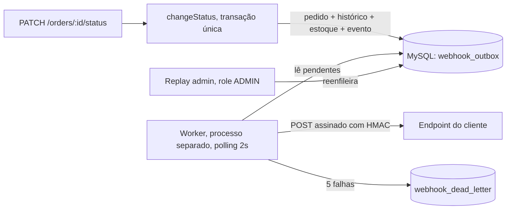

# RFC: Sistema de Webhooks de Notificação de Pedidos

## Metadados

| Campo | Valor |
| --- | --- |
| **Autora** | Larissa, Tech Lead |
| **Revisores** | Marcos (Product Manager), Diego (Engenheiro Sênior, Plataforma), Bruno (Engenheiro Pleno, Pedidos), Sofia (Engenheira de Segurança) |
| **Status** | Em revisão |
| **Data** | 2026-08-16 |
| **Origem** | Reunião técnica registrada em [TRANSCRICAO.md](../TRANSCRICAO.md) |
| **Documentos relacionados** | [PRD](PRD.md), [FDD](FDD.md), [ADRs](adrs/), [TRACKER](TRACKER.md) |

---

## Resumo executivo

Propomos substituir o polling que três clientes B2B fazem hoje na API de pedidos por notificação ativa via webhooks de saída, com latência abaixo de 10 segundos.

A captura do evento usa **padrão Outbox sobre o MySQL que já está em produção**: o evento é gravado dentro da mesma transação que muda o status do pedido, o que torna impossível ter status alterado sem evento correspondente. Um **worker em processo separado**, em polling de 2 segundos, lê a outbox e entrega por HTTP, com **assinatura HMAC-SHA256** e secret exclusiva por endpoint. Falhas passam por **reenvio com backoff em cinco tentativas**, cobrindo cerca de 15 horas, antes de irem para uma **Dead Letter** com replay manual restrito a ADMIN. A entrega é **at-least-once**, com identificador de evento estável no header para deduplicação do lado do cliente.

Nenhuma infraestrutura nova. Nenhuma dependência nova. Uma única alteração em código de produção existente. Estimativa de três sprints, incluindo a revisão de segurança ([09:46] Larissa).

Pedimos revisão especialmente sobre os cinco pontos listados em [Questões em aberto](#questões-em-aberto), que a reunião levantou mas não fechou.

---

## Contexto e problema

O OMS controla o ciclo de vida do pedido com máquina de estados explícita, controle transacional de estoque e auditoria de mudanças de status. O que ele não tem é qualquer mecanismo de notificação externa: não existe evento, fila, mensageria nem webhook em nenhum ponto da codebase.

Três clientes B2B, Atlas Comercial, MaxDistribuição e Nova Cargo, pediram formalmente para serem notificados quando o status dos pedidos deles muda. Hoje eles consultam periodicamente a API de pedidos para descobrir mudanças, o que torna a integração deles lenta e cara ([09:00] Marcos). Para eles, qualquer coisa abaixo de 10 segundos já é tempo real ([09:02] Marcos). O fluxo é exclusivamente de saída, da plataforma para o cliente ([09:02] Marcos, [09:03] Sofia).

Há pressão comercial concreta: a Atlas sinalizou que pode migrar para o concorrente se a entrega não sair até o fim do trimestre ([09:00] Marcos).

O problema técnico central está no ponto de integração. A mudança de status já executa uma transação que atualiza o pedido, grava o histórico e movimenta o estoque, em [order.service.ts:131-178](../src/modules/orders/order.service.ts#L131-L178). Duas exigências entram em tensão nesse ponto: a notificação não pode acoplar a operação interna à disponibilidade de terceiros ([09:04] Bruno), e ao mesmo tempo não pode existir caso de status mudar e evento não sair ([09:40] Bruno).

---

## Proposta técnica

**1. Captura atômica do evento.** Dentro da mesma transação que muda o status, uma função recebe o cliente transacional em uso e grava o evento na outbox, sem injetar o repositório de webhooks dentro do serviço de pedidos ([09:41] Bruno, [09:41] Diego). Commit confirma os dois lados, rollback cancela os dois lados. O filtro por status é aplicado na gravação: se nenhum endpoint do cliente ouve aquele status, nada é gravado ([09:34] Bruno). O payload é congelado no momento da gravação, refletindo o estado do pedido no instante da transição ([09:52] Larissa). Ver [ADR-001](adrs/ADR-001-padrao-outbox-no-mysql.md) e [ADR-007](adrs/ADR-007-snapshot-do-payload-na-insercao.md).

**2. Entrega assíncrona por worker separado.** Processo próprio, fora da API, com instância própria do cliente de banco apontando para o mesmo banco ([09:11] Diego, [09:30] Bruno). Polling a cada 2 segundos, lendo os pendentes mais antigos em lote pequeno, apoiado em índice por estado e data de criação ([09:08] Diego, [09:09] Diego). Um único worker nesta fase, o que garante ordenação por pedido e é registrado como limitação conhecida ([09:12] Diego, [09:13] Larissa). Ver [ADR-002](adrs/ADR-002-worker-em-processo-separado-com-polling.md).

**3. Resiliência da entrega.** Timeout de 10 segundos por chamada ([09:42] Diego). Falha dispara reenvio com backoff de 1m, 5m, 30m, 2h e 12h, em cinco tentativas, cobrindo cerca de 15 horas ([09:17] Diego). Esgotadas as tentativas, o evento vai para uma tabela separada de Dead Letter, com payload, motivo e timestamp, e a recuperação é manual por endpoint administrativo restrito a ADMIN e auditado ([09:18] Diego, [09:36] Sofia). Ver [ADR-003](adrs/ADR-003-retry-com-backoff-exponencial-e-dlq.md).

**4. Autenticidade e integridade.** Cada entrega é assinada com HMAC-SHA256 sobre o corpo, com secret exclusiva por endpoint, gerada pela plataforma e devolvida na criação do cadastro ([09:20] Sofia, [09:21] Sofia, [09:31] Marcos). A secret é rotacionável pela API, com a anterior válida em paralelo por 24 horas ([09:21] Sofia). URL obrigatoriamente https e payload limitado a 64KB, com erro em vez de truncamento ([09:23] Sofia, [09:24] Diego). Ver [ADR-004](adrs/ADR-004-hmac-sha256-com-secret-por-endpoint.md).

**5. Semântica de entrega.** At-least-once, com identificador único do evento enviado em header e estável em todas as tentativas, inclusive após replay. A deduplicação acontece do lado do cliente, padrão adotado por plataformas de referência do mercado ([09:25] Diego). Ver [ADR-005](adrs/ADR-005-entrega-at-least-once-com-x-event-id.md).

**6. Superfície de API.** Cadastro, edição, remoção e listagem de endpoints por cliente, com filtro de quais status cada endpoint quer ouvir ([09:31] Marcos, [09:33] Bruno, [09:33] Marcos). Rotação de secret, consulta do histórico de entregas ([09:34] Marcos) e replay administrativo ([09:35] Diego). O CRUD aceita qualquer role autenticada nesta fase, e apenas o replay exige ADMIN ([09:36] Sofia, [09:37] Sofia). O identificador do cliente vai no corpo ou no caminho, porque o token atual identifica o usuário operador e não o cliente ([09:32] Larissa).

**7. Integração com a codebase.** Módulo novo no mesmo formato dos existentes, erros estendendo a hierarquia atual com prefixo `WEBHOOK_`, e reuso sem alteração do middleware de erro, do logger, da validação e da autorização por papel ([09:27] Bruno, [09:29] Bruno, [09:30] Larissa). Ver [ADR-006](adrs/ADR-006-reuso-dos-padroes-existentes-do-projeto.md).

Contratos de endpoint, payloads de exemplo, matriz de erros e modelo de dados estão no [FDD](FDD.md).

---

## Alternativas consideradas

**Disparo HTTP síncrono dentro da transação de mudança de status.** É a implementação mais direta, sem tabela nova e sem processo novo. Descartada porque a transação já é pesada, e acrescentar uma chamada HTTP faria qualquer cliente lento travar mudança de status de outros pedidos ([09:04] Bruno). Pior, não existe resposta aceitável para o caso do cliente estar fora do ar: dar rollback em uma mudança de negócio que já aconteceu não é opção, e ignorar a falha em silêncio viola o requisito de confiabilidade.
**Trade-off que motivou o descarte:** simplicidade imediata em troca de acoplar a disponibilidade da operação mais crítica do OMS à disponibilidade de terceiros.

**Fila ou stream externo, como Redis Streams.** Padrão clássico de desacoplamento, com recursos prontos de fila e capacidade de escala. Descartada porque exigiria subir mais infraestrutura para um time pequeno, o que Diego classificou como overengineering diante de uma outbox no MySQL existente que resolve ([09:07] Larissa, [09:07] Diego). Soma-se o fato de que a publicação aconteceria depois do commit, deixando uma janela em que o status muda e o evento não é publicado.
**Trade-off que motivou o descarte:** capacidade de escala e ferramental pronto em troca de infraestrutura nova para operar e de uma janela de inconsistência que o outbox elimina.

**Trigger de banco para acordar o worker de forma reativa.** Proposta por Bruno para eliminar o atraso do polling ([09:09] Bruno). Descartada porque o MySQL não tem listener nativo equivalente ao do Postgres, e a trigger apenas executa SQL, sem notificar processo externo. Avisar o worker exigiria improvisar escrita em arquivo ou chamada de endpoint ([09:09] Diego).
**Trade-off que motivou o descarte:** latência menor que o piso de 2 segundos em troca de um mecanismo frágil e não idiomático, sem ganho real diante de um requisito de 10 segundos.

**Garantia exactly-once.** Eliminaria a necessidade de deduplicação do lado do cliente. Descartada porque exigiria coordenação dos dois lados e complexidade muito maior, enquanto at-least-once com identificador de evento resolve a quase totalidade dos casos ([09:25] Diego).
**Trade-off que motivou o descarte:** promessa mais forte ao cliente em troca de um protocolo de confirmação bilateral, com estado adicional e novos modos de falha.

**Secret global da plataforma e reenvio com três tentativas ou indefinido.** A secret global foi descartada porque se vaza uma, vaza tudo ([09:21] Sofia). Três tentativas foram descartadas por encerrarem o evento em cerca de 30 minutos, insuficiente diante de caso real de cliente com duas horas de manutenção ([09:16] Diego). Reenvio indefinido foi descartado por deixar o evento pendurado para sempre se o cliente sumir ([09:15] Diego).
**Trade-off que motivou o descarte:** em ambos os casos, simplicidade operacional em troca de risco concentrado, no caso da secret, e de perda de eventos recuperáveis ou de acúmulo sem fim, no caso das políticas de reenvio.

---

## Questões em aberto

Pontos levantados na reunião e não fechados. São o foco principal desta revisão.

**1. Controle de vazão na saída.** Se um cliente tem 50 pedidos mudando de status em um minuto, a plataforma dispara 50 chamadas contra o endpoint dele. Diego levantou o risco e a decisão foi observar em produção e implementar se virar problema, sem definição de gatilho nem de política ([09:38] Diego, [09:39] Diego, [09:39] Larissa).

**2. Escala para múltiplos workers.** A ordenação por pedido depende de haver um único worker. Os caminhos possíveis, particionar por pedido ou usar lock pessimista, foram citados mas não avaliados, e o assunto foi adiado como problema do futuro ([09:12] Diego, [09:13] Diego).

**3. Arquivamento das linhas entregues da outbox.** Diego mencionou arquivar depois de algo como 30 dias e declarou o tema fora do escopo desta feature, sem definir prazo, gatilho ou destino das linhas arquivadas ([09:08] Diego). A tabela cresce continuamente até que isso seja decidido.

**4. Endurecimento de permissão no CRUD de configuração.** Nesta fase qualquer role autenticada pode criar ou alterar a URL de destino de um webhook, inclusive de clientes que não são o dele. Sofia aceitou por enquanto e disse que mais para frente pode endurecer, sem definir critério nem prazo ([09:36] Marcos, [09:37] Sofia).

**5. Destino dos eventos já gravados quando um endpoint é removido.** Esta questão não foi levantada na reunião e apareceu ao detalhar o desenho. Um endpoint removido pode ter eventos pendentes ou em reenvio na outbox, e não há definição sobre descartá-los, entregá-los mesmo assim ou movê-los para a Dead Letter. A implementação não deve assumir comportamento sem essa definição.

Registramos também, para não confundir com questão em aberto, dois itens que foram decididos e simplesmente não entram nesta fase: aviso por email ao cliente quando o webhook dele falha, adiado para reavaliação após medir o impacto ([09:37] Larissa), e dashboard visual, que é projeto separado do time de frontend ([09:40] Larissa).

---

## Impacto e riscos

**Impacto no sistema existente.** Um único ponto de mudança em código de produção: a chamada de publicação dentro da transação de mudança de status. Todo o resto é adição, com módulo novo, tabelas novas por migration aditiva e uma entry-point de processo nova. Middleware de erro, logger, autenticação, validação e paginação não mudam. Nenhuma rota existente muda de caminho, contrato ou código de status, e nenhuma dependência npm nova é introduzida.

**Impacto operacional.** Passa a existir um segundo processo em produção, com implantação, monitoramento e ciclo de reinício próprios. A plataforma passa também a guardar material sensível, uma secret por endpoint cadastrado.

**Riscos principais**

- **Falha na gravação do evento derruba a mudança de status.** É o comportamento desejado para garantir consistência, mas coloca a operação mais crítica do OMS na dependência de um módulo novo. Contenção: manter a operação dentro da transação restrita a uma consulta e inserções simples, e testar commit e rollback como critério bloqueante. Se necessário em produção, desativar os endpoints faz a gravação parar de acontecer, porque o filtro é aplicado na gravação ([09:34] Bruno).
- **Worker parado acumula backlog em silêncio.** Nada falha visivelmente, os eventos apenas se acumulam e a meta de 10 segundos é ultrapassada. Nenhum evento se perde, porque o estado vive no banco, mas a detecção depende de observar a contagem de pendentes e a idade do evento mais antigo.
- **Evento morre na Dead Letter sem ninguém perceber.** Não existe aviso automático nesta fase ([09:37] Larissa), então a descoberta depende de consulta ativa.
- **Cliente que não deduplica processa evento repetido.** Risco levantado por Sofia na própria reunião ([09:25] Sofia) e aceito com o compromisso de documentar a semântica de forma destacada no portal do desenvolvedor ([09:26] Marcos).
- **Vazamento de secret pelo cliente**, cenário com precedente real ([09:22] Diego). Contido por secret exclusiva por endpoint e rotação com convivência de 24 horas.
- **Prazo.** A Atlas espera a entrega para o fim do trimestre, e a estimativa de três sprints já inclui os dois dias úteis de revisão de segurança, que é bloqueante para o deploy ([09:46] Larissa, [09:46] Sofia).

---

## Decisões relacionadas

| ADR | Decisão |
| --- | --- |
| [ADR-001](adrs/ADR-001-padrao-outbox-no-mysql.md) | Padrão Outbox no MySQL existente |
| [ADR-002](adrs/ADR-002-worker-em-processo-separado-com-polling.md) | Worker em processo separado com polling de 2 segundos |
| [ADR-003](adrs/ADR-003-retry-com-backoff-exponencial-e-dlq.md) | Reenvio com backoff, cinco tentativas e Dead Letter em tabela separada |
| [ADR-004](adrs/ADR-004-hmac-sha256-com-secret-por-endpoint.md) | HMAC-SHA256 com secret por endpoint e rotação com grace period de 24 horas |
| [ADR-005](adrs/ADR-005-entrega-at-least-once-com-x-event-id.md) | Entrega at-least-once com identificador de evento no header |
| [ADR-006](adrs/ADR-006-reuso-dos-padroes-existentes-do-projeto.md) | Reuso máximo dos padrões existentes do projeto |
| [ADR-007](adrs/ADR-007-snapshot-do-payload-na-insercao.md) | Payload congelado no momento da gravação |

O índice completo, com as relações entre as decisões e a lista do que não virou ADR, está em [docs/adrs/README.md](adrs/README.md).
